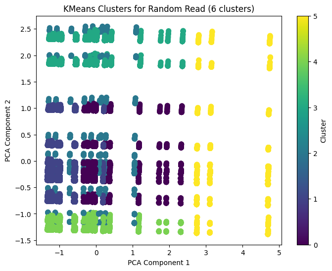

# "Replace with Clustering Algorithm Chosen" Clustering:
Silhouette Datas:

## Random Read:

Silhouette Score for Random Read with 6 Clusters: 0.38373159433069887  
Top Cluster for Random Read: Cluster 3

*Figure: KMeans clustering for Random Read data showing top cluster and silhouette score.*

## Random Write:

*Figure: KMeans clustering for Random Read data showing top cluster and silhouette score.*

## Sequential Write

## Sequential Read

## Random Write Latency

## Random Read Latency
