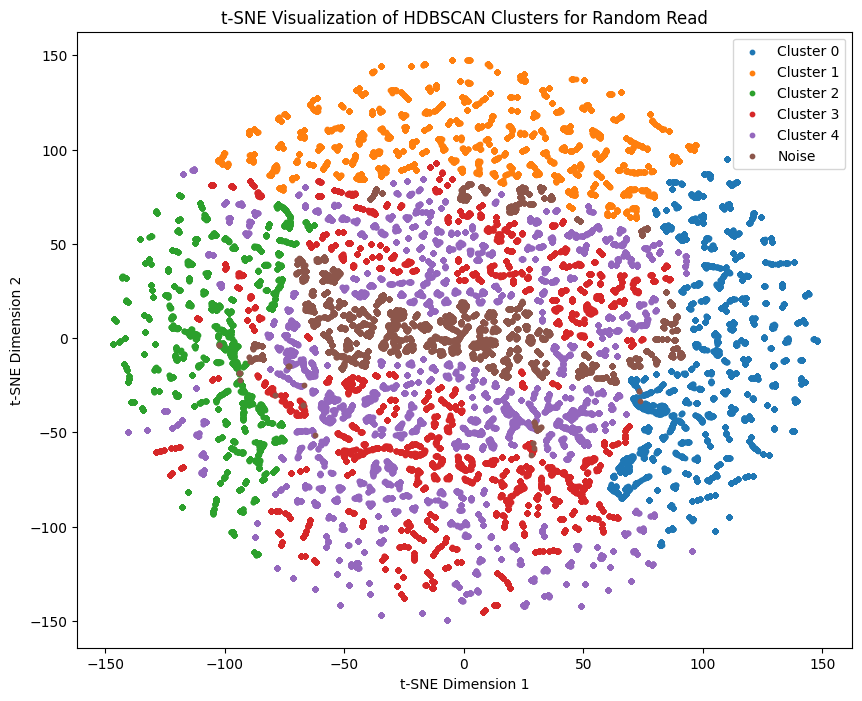
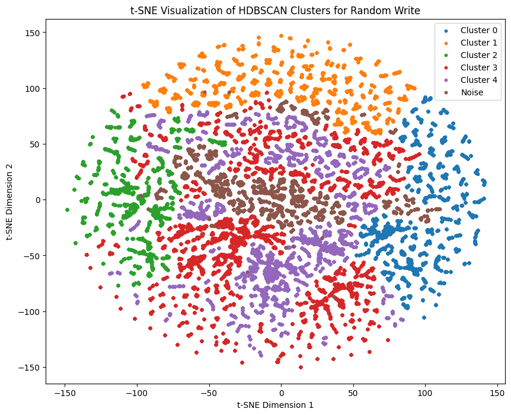
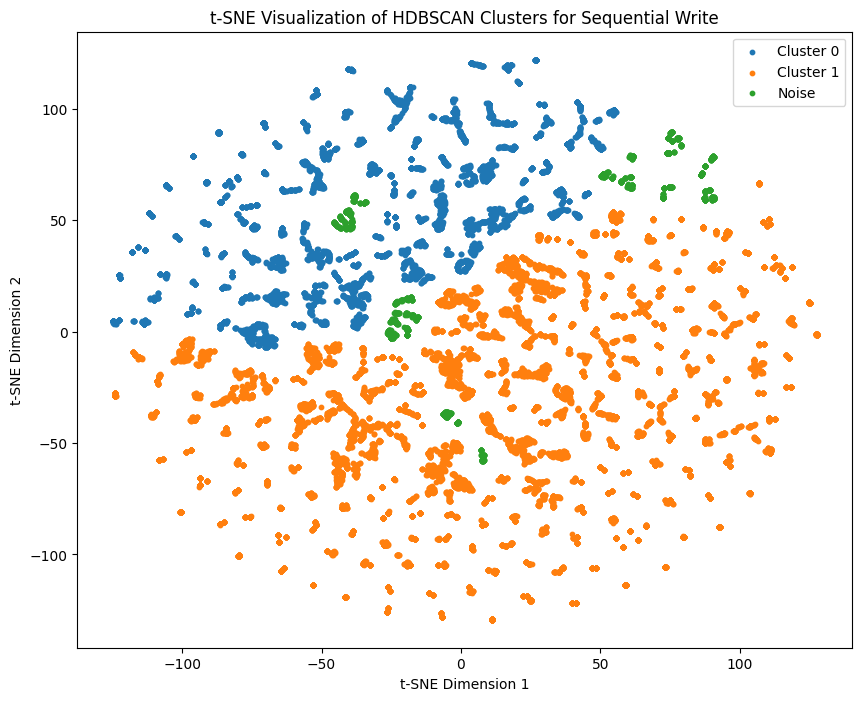
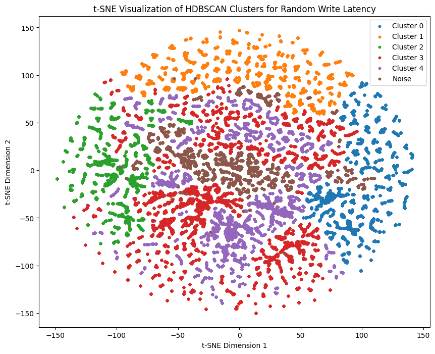
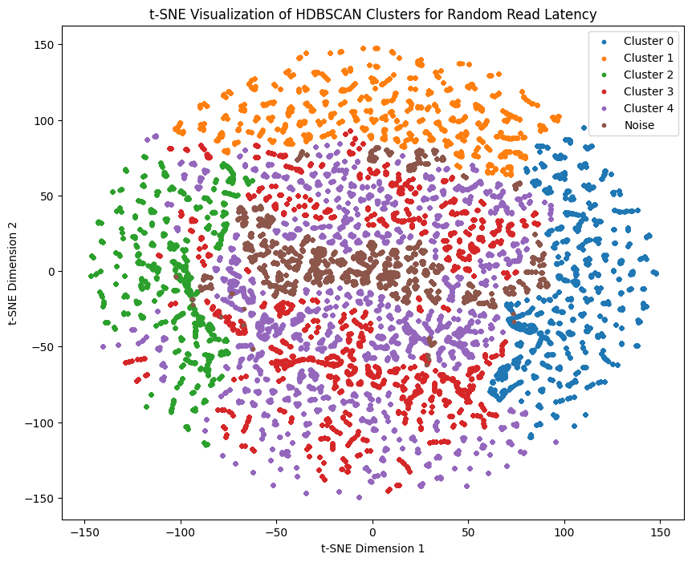

# HDBSCAN Clustering:

## Random Read:
Silhouette Score for Random Read with min_samples=15: 0.1926

*Figure: HDBSCAN clustering for Random Read data showing clustering and silhouette score.*

## Random Write:
Silhouette Score for Random Write with min_samples=15: 0.1933

*Figure: HDBSCAN clustering for Random Read data showing clustering and silhouette score.*

## Sequential Read
Silhouette Score for Sequential Read with min_samples=15: 0.1914

*Figure: HDBSCAN clustering for Sequential Read data showing clustering and silhouette score.*

## Sequential Write
Silhouette Score for Sequential Write with min_samples=15: 0.1929

*Figure: HDBSCAN clustering for Sequential Write data showing clustering and silhouette score.*

## Random Write Latency
Silhouette Score for Random Write with min_samples=10: 0.2092

*Figure: HDBSCAN clustering for Random Write Latency data showing clustering and silhouette score.*

## Random Read Latency
Silhouette Score for Random Read Latency with min_samples=10: 0.2091

*Figure: HDBSCAN clustering for Random Read Latency data showing clustering and silhouette score.*