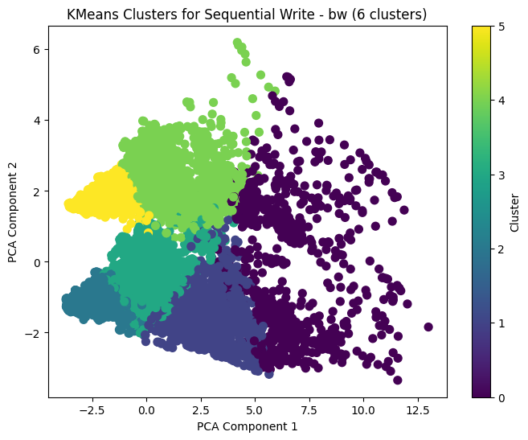

# K-Means Clustering:

## Random Read (Latency):

Silhouette Score for Random Read - latency with 6 Clusters: 0.3528179844647217    
Top Cluster for Random Read - latency: Cluster 4      
Top-performing Device and Model for Random Read - latency: (np.int64(0), np.int64(124))  

*Figure: KMeans clustering for Random Read Latency data showing top cluster and silhouette score.*

## Random Read (IOPS):

Silhouette Score for Random Read - iops with 6 Clusters: 0.3481148483040398   
Top Cluster for Random Read - iops: Cluster 3    
Top-performing Device and Model for Random Read - iops: (np.int64(0), np.int64(22))  

*Figure: KMeans clustering for Random Read IOPS data showing top cluster and silhouette score.*

## Random Write Latency

Silhouette Score for Random Write - latency with 6 Clusters: 0.40160844237760196  
Top Cluster for Random Write - latency: Cluster 4  
Top-performing Device and Model for Random Write - latency: (np.int64(0), np.int64(28))  

*Figure: KMeans clustering for Random Write Latency data showing top cluster and silhouette score.*

## Random Write IOPS

Silhouette Score for Random Write - iops with 6 Clusters: 0.3702056885573302  
Top Cluster for Random Write - iops: Cluster 1  
Top-performing Device and Model for Random Write - iops: (np.int64(0), np.int64(110))  

*Figure: KMeans clustering for Random Write IOPS data showing top cluster and silhouette score.*

## Sequential Read Latency

Silhouette Score for Sequential Read - latency with 6 Clusters: 0.33408004965987553  
Top Cluster for Sequential Read - latency: Cluster 0  
Top-performing Device and Model for Sequential Read - latency: (np.int64(0), np.int64(13))  

*Figure: KMeans clustering for Sequential Read Latency data showing top cluster and silhouette score.*

## Sequential Read BW

Silhouette Score for Sequential Read - bw with 6 Clusters: 0.30234238726542473  
Top Cluster for Sequential Read - bw: Cluster 2  
Top-performing Device and Model for Sequential Read - bw: (np.int64(0), np.int64(79))  

*Figure: KMeans clustering for Sequential Read BW data showing top cluster and silhouette score.*

## Sequential Write Latency

Silhouette Score for Sequential Write - latency with 6 Clusters: 0.28223091888708246  
Top Cluster for Sequential Write - latency: Cluster 0  
Top-performing Device and Model for Sequential Write - latency: (np.int64(0), np.int64(28))  

*Figure: KMeans clustering for Sequential Write Latency data showing top cluster and silhouette score.*

## Sequential Write BW

Silhouette Score for Sequential Write - bw with 6 Clusters: 0.22937276421562322  
Top Cluster for Sequential Write - bw: Cluster 0  
Top-performing Device and Model for Sequential Write - bw: (np.int64(0), np.int64(27))  

*Figure: KMeans clustering for Sequential Write BW data showing top cluster and silhouette score.*

