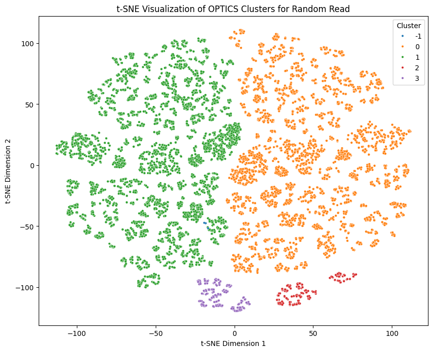
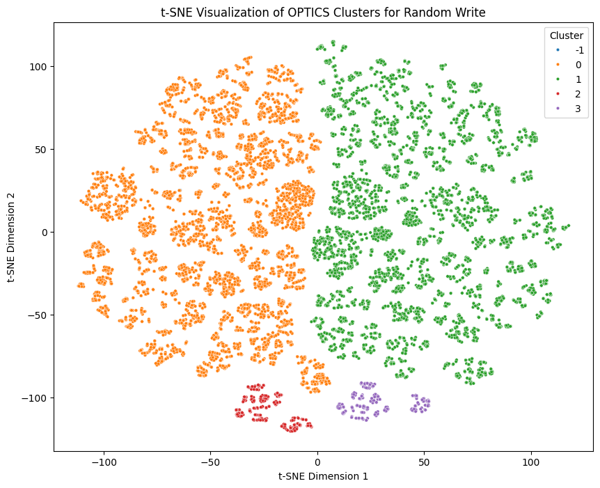
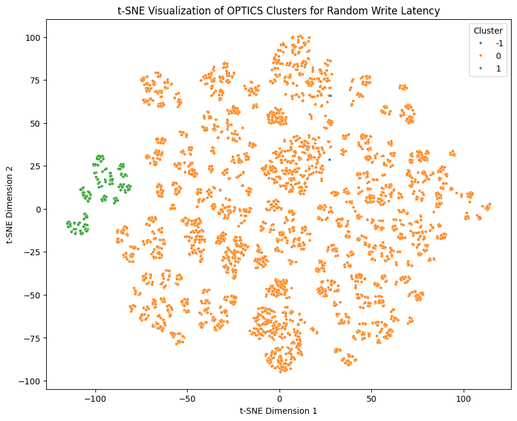
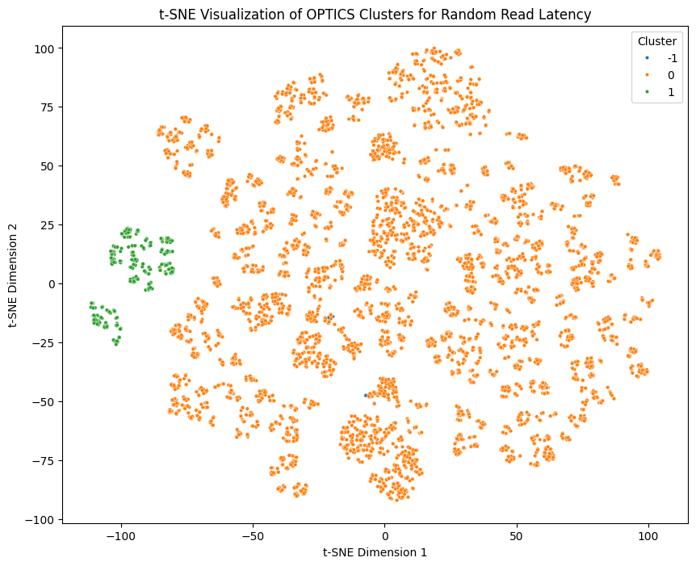

# "Optics" Clustering:
Silhouette Datas:

## Random Read:
Silhouette Score for Random Read with min_samples=100: 0.2685

## Random Write:
Silhouette Score for Random Write with min_samples=100: 0.2669

## Sequential Write
Silhouette Score for Sequential Write with min_samples=100: 0.3672

## Sequential Read
Silhouette Score for Sequential Read with min_samples=100: 0.3690

## Random Write Latency
Silhouette Score for Random Write Latency with min_samples=100: 0.3226

## Random Read Latency

