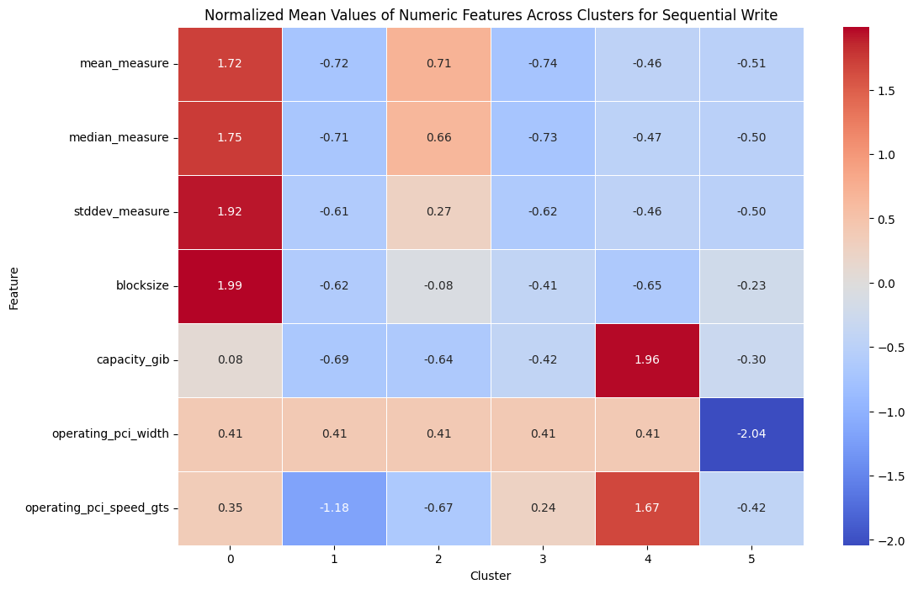

# Sequential Write Analysis
This analysis focuses on the sequential write performance across six clusters. 

### Notes
- **No Categorical Data**: This analysis was conducted without including any categorical features.
- **Interpretation**: The heatmap provides insights into the relative performance metrics across clusters. Each cluster's characteristics are highlighted to help identify patterns or anomalies.
---

## Heatmap (Non-Normalized)
### Silhouette Score for Sequential Write with 6 Clusters: 0.209

### Notes
- **No Normalization**: This analysis was conducted with raw clustering data
- **Interpretation**: Heatmap color is distributed unevenly as large values from blocksize are causing relatively smaller values like min_measure to be categorized as 'blue'

---
## Heatmap (Baseline of Normalized Graph)
### Silhouette Score for Sequential Write with 6 Clusters: 0.209

### Notes
- **Normalization**: This analysis was conducted with data normalized using Z-score normalization. Z-score normalization transforms each feature by subtracting the mean and dividing by the standard deviation. This centers the data around a mean of 0 with a standard deviation of 1, making it easier to compare features on different scales.

This formula transforms the data to have a mean of 0 and a standard deviation of 1, making it easier to compare values across different features.

- **Interpretation of Heatmap Colors**:
    - **Red**: Values that are significantly higher than the mean for each feature. These values have high positive Z-scores, indicating that they are well above the average for that feature.
    - **Beige**: Values closest to the mean, with Z-scores near 0. This color represents data points that are close to the average, indicating typical or average values for that feature.
    - **Blue**: Values that are significantly lower than the mean. These have high negative Z-scores, showing that they are well below the average for that feature.
  
  This color distribution helps in visually identifying clusters that have unusually high or low values for specific features. Extreme colors (red and blue) indicate values far from the mean, highlighting clusters that deviate strongly from the average in either direction.

--- 
## Feature Selection Process to Determine Clustering Impact

To identify the features that most influence clustering, we used an iterative feature removal approach, observing changes in silhouette scores and heatmap distributions. The **base silhouette score was 0.209**.

### Process for Each Iteration:

1. **Feature Removal Criteria**:
   - **Correlated Features**: Identify features with similar distributions across clusters and remove one of each correlated pair.
     - *Reasoning*: Features that are highly correlated contribute redundant information, potentially skewing the clustering results. Removing one from each correlated pair helps streamline the dataset, reducing noise without losing important data.
   - **Low-Variance Features**: If a feature shows minimal variation (uniform color distribution across clusters), it is likely redundant and is considered for removal.
     - *Reasoning*: Low-variance features do not provide significant differentiation between clusters. By removing these features, we focus the clustering algorithm on attributes that vary meaningfully across clusters, which improves clustering accuracy.

2. **Evaluate Silhouette Score Impact**:
   - If the silhouette score changes by **less than 0.1**, the feature is permanently removed.
     - *Reasoning*: A minimal change in silhouette score (under 0.1) suggests that the feature has little impact on the cluster structure. Permanently removing it helps simplify the dataset without compromising clustering quality.
   - If the silhouette score changes by **more than 0.1**, the feature is retained.
     - *Reasoning*: A significant change in silhouette score (over 0.1) implies that the feature substantially contributes to the cluster structure. Retaining it ensures that key distinguishing characteristics between clusters are preserved.

## Summary of Silhouette Score Changes by Generation

| Generation | Feature(s) Removed           | Silhouette Score | Difference from Base (0.209) |
|------------|-------------------------------|------------------|------------------------------|
| 1st        | Min Measure                   | 0.199           | -0.010                       |
| 2nd        | Max Measure                   | 0.208           | -0.001                       |
| 3rd        | Median Measure                | 0.176           | -0.033                       |
| 4th        | Operating PCI Width           | 0.219           | +0.010                       |
| 5th        | Operating PCI Speed GTS       | 0.281           | +0.072                       |
| 6th        | Queue Depth                   | 0.268           | +0.059                       |
| 7th        | Num Jobs                      | 0.251           | +0.042                       |
| 8th        | Blocksize                     | 0.199           | -0.010                       |
| 9th        | Capacity GIB                  | 0.239           | +0.030                       |
| 10th       | stddev Measure                | 0.174           | -0.035                       |
| 11th       | Mean Measure                  | 0.236           | +0.027                       |

### Observations:
- **Largest Increase**: Removing **Operating PCI Speed GTS** in Generation 5 led to the most significant increase (+0.072).
- **Largest Decrease**: Removing **stddev Measure** in Generation 10 resulted in the largest drop (-0.035).
- **Final Approach**: Generations 5 and 6 saw the most considerable improvements, suggesting that **Operating PCI Speed GTS** and **Queue Depth** had a positive impact when removed.

--- 
# 1st Generation - Removed Min Measure 

**Reason for Removing Feature** : Min Measure is correlated to median measure and mean measure 

## Silhouette Score for Sequential Write with 6 Clusters: 0.199

- **Interpretation of Heatmap Colors**
    - No Significant Changes in Silhouette Score 
    - No Significant change to Heatmap distribution 

---

# 2nd Generation - Removed Max Measure 

**Reason for Removing Feature** : Max Measure is correlated to median measure and mean measure 

**List of Removed Features** 
- Min Measure 
- Max Measure 

## Silhouette Score for Sequential Write with 6 Clusters: 0.20812993223821197

- **Interpretation of Heatmap Colors**
    - No Significant Changes in Silhouette Score 
    - No Significant change to Heatmap distribution expect for a reordering of best performing drives from cluster 0 to cluster 4

--- 

---

# 3rd Generation - Removed Median Measure 

**Reason for Removing Feature** : Median Measure is correlated to means measure

**List of Removed Features** 
- Min Measure 
- Max Measure 
- Median Measure

**Influencial Features** 
- Median Measure

## Silhouette Score for Sequential Write with 6 Clusters: 0.17603095191334633

- **Interpretation of Heatmap Colors**
    - Dip in Silhouette Score revealing that mediam measure values has a strong influence on clustering
    - Significant change to Heatmap distribution see most predominately in num jobs and blocksize 

- **NOTES** : Due to the siginficant change in distribution Median Measure will be added back to the data set
--- 

# 4th Generation - Added Median Measure and Removed Operating PCI Width

**Reason for Removing Feature** : Operating Width has uniform features (has little color variation)

**List of Removed Features** 
- Min Measure 
- Max Measure 
- Operating PCI Width

**Influencial Features** 
- Median Measure

## Silhouette Score for Sequential Write with 6 Clusters: 0.21872589023339853

- **Interpretation of Heatmap Colors**
    - Slight change to Silhouette Score
    - Slight change to Heatmap other than a reordering of clusters

--- 
# 5th Generation - Added Operating PCI Width /  Removed Operating PCI Speed GTS

**Reason for Removing Feature** : Operating Width and Operating PCI speed are often correlated 

**List of Removed Features** 
- Min Measure 
- Max Measure 
- Operating PCI Speed

**Influencial Features** 
- Median Measure

## Silhouette Score for Sequential Write with 6 Clusters: 0.2807998514499788

- **Interpretation of Heatmap Colors**
    - Significant increase to Silhouette Score (+0.8)
    - Significant change to Heatmap more variations in queue depth, num jobs, blocksize, capacitygib

--- 
 
# 6th Generation - Added Operating PCI Speed GTS / Removed Queue Depth

**Reason for Removing Feature** : Little Variation within the distribution of queue depth

**List of Removed Features** 
- Min Measure 
- Max Measure 
- Queue Depth

**Influencial Features** 
- Median Measure

## Silhouette Score for Sequential Write with 6 Clusters: 0.26845283352235066

- **Interpretation of Heatmap Colors**
    - Significant Increase in Silhouette Score (+0.6)
    - Heatmap distribution increase in color variation
--- 
# 7th Generation - Added Queue Depth / Removed Num Jobs

**Reason for Removing Feature** : queue depth and num jobs are often correlated 

**List of Removed Features** 
- Min Measure 
- Max Measure 
- Num Jobs

**Influencial Features** 
- Median Measure

## Silhouette Score for Sequential Write with 6 Clusters: 0.25086616180934823

- **Interpretation of Heatmap Colors**
    - Slight Increase in Silhouette Score (+0.1)
    - Heatmap distribution increases in color variation
--- 
# 8th Generation - Added Num Jobs / Removed Blocksize

**Reason for Removing Feature** : queue depth and num jobs are often correlated 

**List of Removed Features** 
- Min Measure 
- Max Measure 
- Blocksize

**Influencial Features** 
- Median Measure
- Queue Depth
- Num Jobs

## Silhouette Score for Sequential Write with 6 Clusters: 0.1991007171513654

- **Interpretation of Heatmap Colors**
    - No significant change to Silhouette Score 
    - No siginficant change to Heatmap 
    - Blocksize is an insignificant feature to Sequential Write 

---
# 9th Generation - Added Block Size / Removed Capacity GIB

**Reason for Removing Feature** : feature is yet to be removed

**List of Removed Features** 
- Min Measure 
- Max Measure 
- Capacity Gib

**Influencial Features** 
- Median Measure
- Queue Depth
- Num Jobs

## Silhouette Score for Sequential Write with 6 Clusters: 0.23867545462393513

- **Interpretation of Heatmap Colors**
    - Significant Increase to Silhouette Score (+0.3)
    - Heatmap distribution decreased in color variation
---
# 10th Generation - Added Capacity Gib / Removed stddev measure

**Reason for Removing Feature** : feature is yet to be removed

**List of Removed Features** 
- Min Measure 
- Max Measure 
- stddev measure

**Influencial Features** 
- Median Measure
- stddev measure
- Queue Depth
- Num Jobs

## Silhouette Score for Sequential Write with 6 Clusters: 0.17434935220347297

- **Interpretation of Heatmap Colors**
    - Significant Decrease to Silhouette Score (-0.3)
    - Heatmap distribution increased in color variation
---
# 11th Generation - Added stddev measur / Removed mean measure

**Reason for Removing Feature** : feature is yet to be removed

**List of Removed Features** 
- Min Measure 
- Max Measure 
- Mean measure

**Influencial Features** 
- Median Measure
- stddev measure
- Queue Depth
- Num Jobs

## Silhouette Score for Sequential Write with 6 Clusters: 0.2364975139134526

- **Interpretation of Heatmap Colors**
    - Significant Increase to Silhouette Score (0.3)
    - Heatmap distribution increased in color variation
---

# 12th Generation - Added stddev measur / Removed mean measure

**Reason for Removing Feature** : feature is yet to be removed

**List of Removed Features** 
- Min Measure 
- Max Measure 
- Mean measure

**Influencial Features** 
- Median Measure
- stddev measure
- Queue Depth
- Num Jobs

## Silhouette Score for Sequential Write with 6 Clusters: 0.2364975139134526

- **Interpretation of Heatmap Colors**
    - Significant Increase to Silhouette Score (0.3)
    - Heatmap distribution increased in color variation
---

