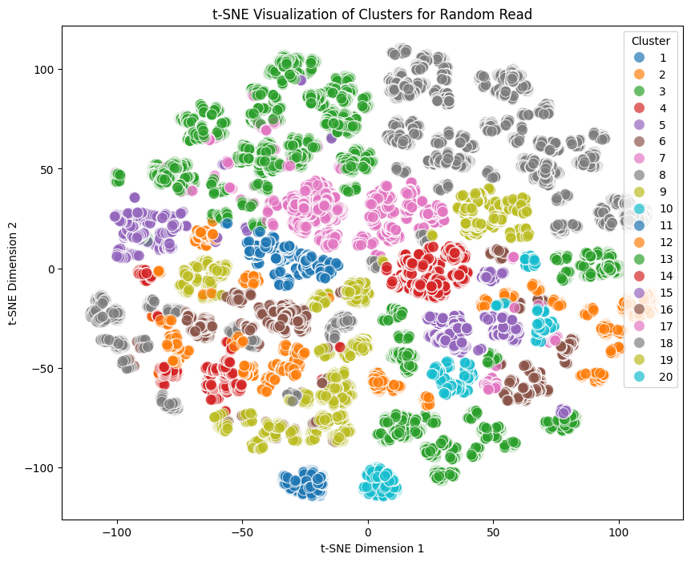
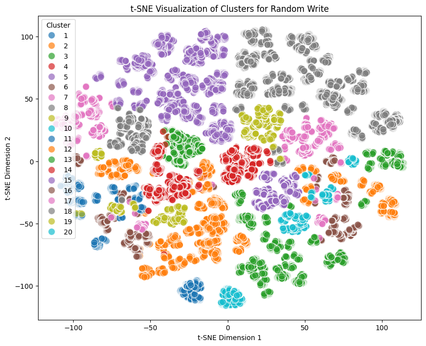
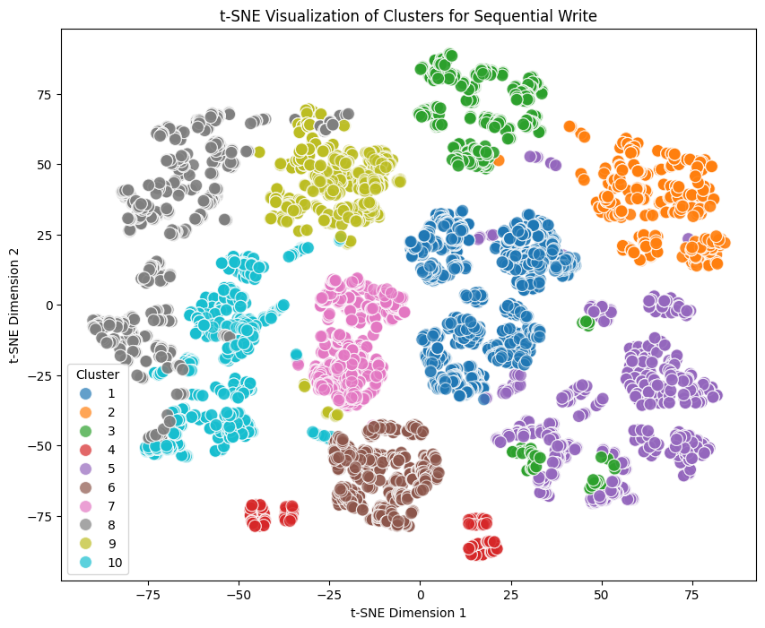
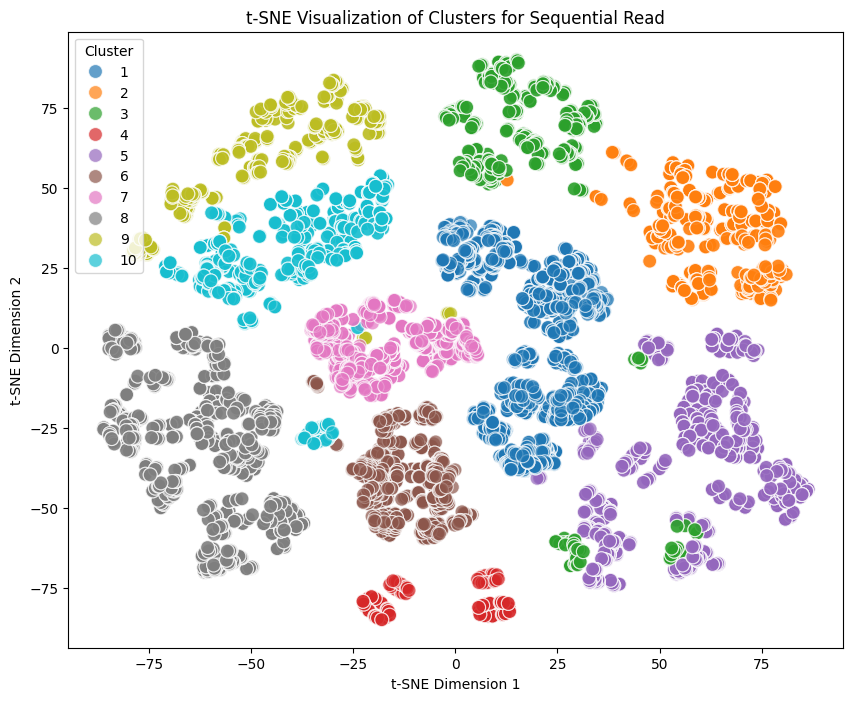
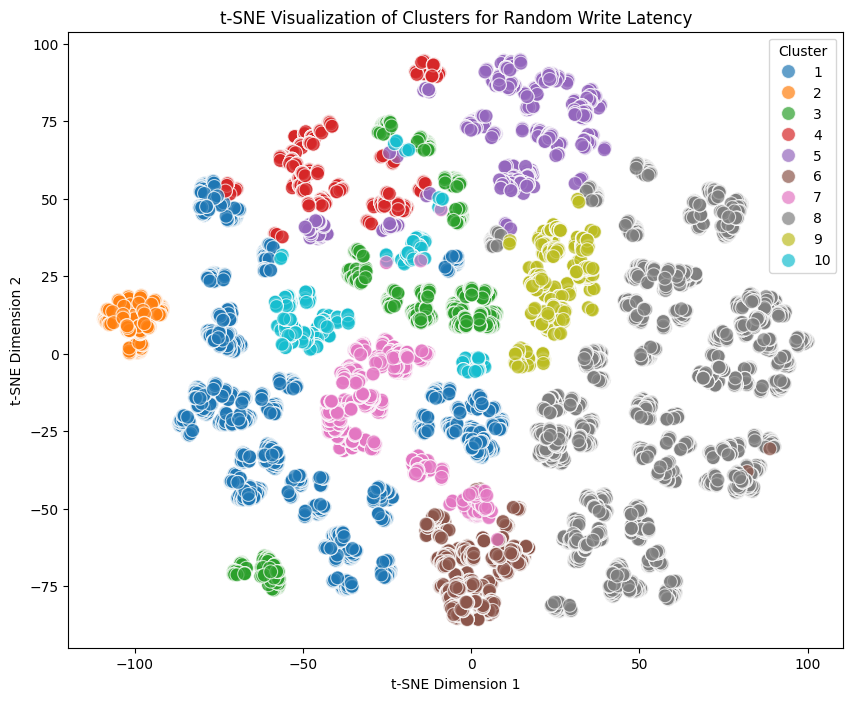
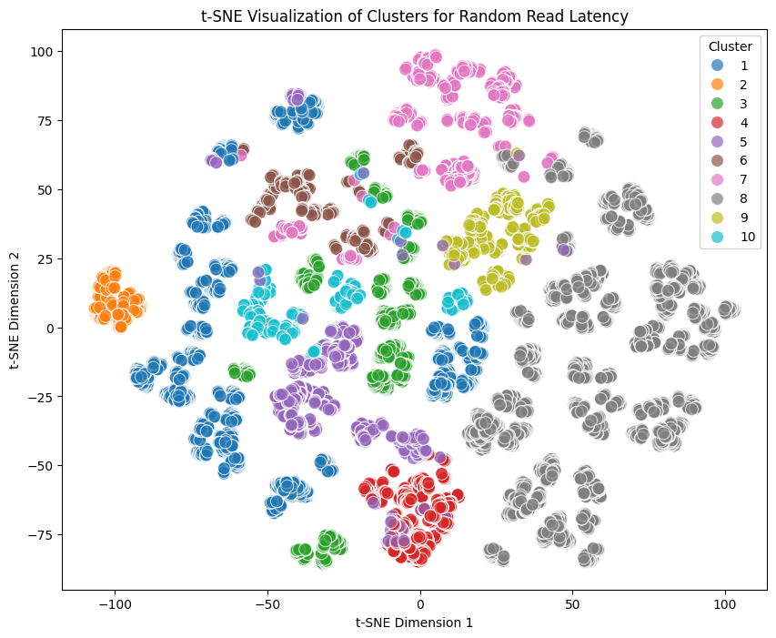

# Hierarchical Clustering:
Silhouette Datas:

Silhouette Score for Random Read Latency with distance_threshold=20: 0.1702

Silhouette Score for Random Write Latency with distance_threshold=20: 0.1731

Silhouette Score for Random Read with distance_threshold=20: 0.1762

Silhouette Score for Random Write with distance_threshold=20: 0.1616

Silhouette Score for Sequential Read with distance_threshold=20: 0.1425

Silhouette Score for Sequential Write with distance_threshold=20: 0.1487

## Random Read:

Silhouette Score for Random Read with distance_threshold=20: 0.1762

*Figure: Hierarchical clustering for Random Read data.*

## Random Write:

Silhouette Score for Random Write with distance_threshold=20: 0.1616

*Figure: Hierarchical clustering for Random Write data.*

## Sequential Write

Silhouette Score for Sequential Write with distance_threshold=20: 0.1487

*Figure: Hierarchical clustering for Sequential Write data.*

## Sequential Read

Silhouette Score for Sequential Read with distance_threshold=20: 0.1425

*Figure: Hierarchical clustering for Sequential Read data.*

## Random Write Latency

Silhouette Score for Random Write Latency with distance_threshold=20: 0.1731

*Figure: Hierarchical clustering for Random Write Latency data.*

## Random Read Latency

Silhouette Score for Random Read Latency with distance_threshold=20: 0.1702

*Figure: Hierarchical clustering for Random Read Latency data.*